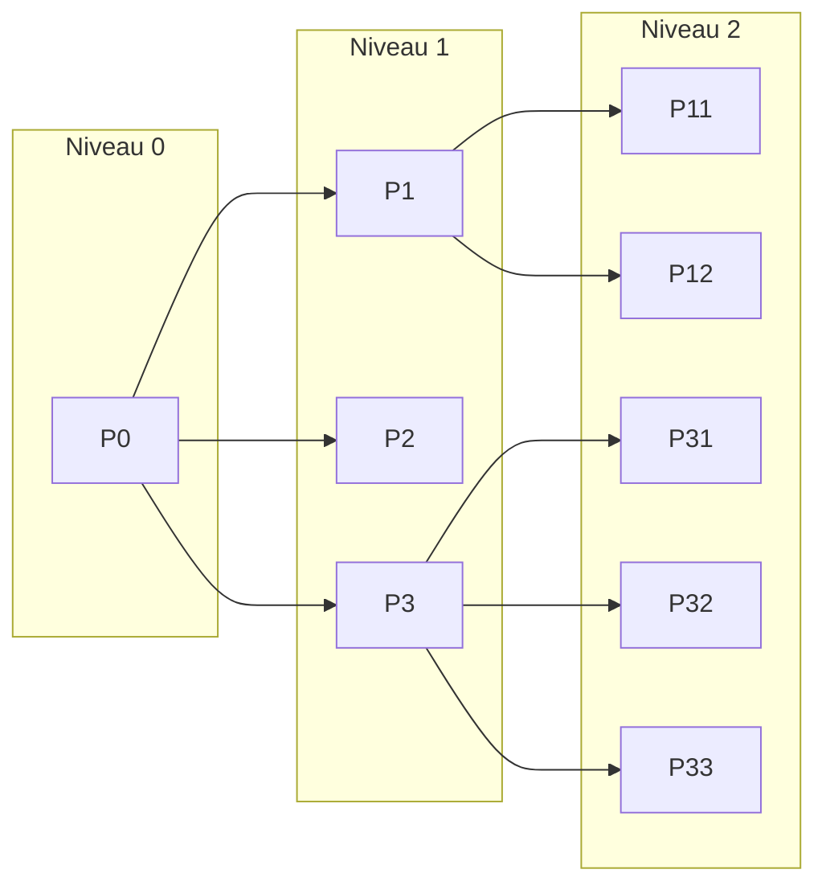

# Generalites sur l'algorithmique

### Notions d'objets et d'actions

##### Les objets

Forme l´ensemble des éléments qui sont manipulés:

- ###### Les types
  - Le rôle d'un type est de permettre de **classer** les objets dans des familles
  - et de permettre ainsi des **manipulations** uniquement entre objets d'une même famille
  - Le types est **caractérisé par**:
    - L´ensemble des **valeurs** que les objects de ce type peuvent prendre
    - L´ensemble des **actions** que l'on peut faire sur les objects de ce type
- ###### Les constantes
  - Elles sont définies par un **identificateur**, et par une **valeur**.
  - Cette valeur est **invariante**
- ###### Les variables
  - Elles sont définies par un **identificateur**, et par une **valeur**.
  - Cette valeur est **variante**
  - Le rôle de la variable est de **stocker** des valeurs ...
    - pour pouvoir les **relire**, les **comparer**, les **modifier**
- ###### Les procédures et fonctions
  - La **différence** entre une procédure et une fonction réside dans le fait que:
    - **une procédure** exécute une tâche **sans** nécessairement **retourner de valeur**
    - tandis qu'**une fonction** effectue une tâche et **renvoie un résultat**.

##### Les actions

- Les actions sont toutes les **opérations** qui pourront être réalisées sur les objets
- Plusieurs **catégories** d'actions seront distinguées:

  - ###### Les actions d'observation
    - permettent de **comparer** deux objects de même type
    - ne peut se faire que si le type est **ordonné** (peut être classer du plus petit au plus grand)
  - ###### Les actions de modification
    - **donner une valeur** à une variable
  - ###### Les actions alternatives

    - permettent d'effectuer des actions suivant certaines **conditions**.

  - ###### Les actions répétitives
    - permettent d'**itérer** des actions
    - une **condition** permet de mettre fin à cette itération.
      > notre algorithme est forcement faux si la boucle ne modifie pas la condition de terminaison
  - ###### Les actions complexes
    - représentent l'appel d'une **procédure**
      > c'est donc le déroulement des actions comprises dans la procédure

### Structure général d'un algorithme

##### Structure général du block

```js
// définition des object du bloc
Interface de bloc // programme, procédure ou fonction
// commantaire sur le rôle du block
constantes // définition des constantes du block
types // définition des types du bloc
variables // définition des variables du block
procédure // définition des procédure appelés par le bloc
// Définition des actions du block
début
    actions // actions qui seront effectuées lors de l´activation du block
fin
```

##### Graphe arborescent

- L'algorithme peut être représenté par un **graphe arborescent**
  - appelé aussi **arbre des appels des procédures**
- Chaque case représente, le **programme principal** (la racine), **une procédure**, ou **une fonction**.



# Le langage algorithmique

### Les elements du language algorithmique

- ##### Caractères utilisée

  - Les _majuscules_, _minuscule_, _chiffres_, et _signes_
    > Aucune distinction entre les majuscules et les minuscules n'est faite.

- ##### Mots réservés

  - _alors, autrecas, booléen, caractère, choix, constantes, créer, de, début, détruire, div, écrire, enregistrement, entier, entrée, et, faire, faux, fermer, fichier, fin, finchoix, finenregistrement, finfichier, finsi, fintantque, fonction, indexé, jusquà, lire, mod, non, null, ou, ouvrir, pointeur, positionner, procédure, programme, quelconque, réel, répéter, retourner, si, sinon, sortie, sur, tableau, tantque, types, variables, vrai_

- ##### Identificateurs
  - Les identificateurs sont les **noms donnés** aux différents objets
    > ils doivent commencer par une lettre, et ne contiennent pas d´espace ou de symboles
- ##### Commentaires
  - Un commentaire commence par `//`, ou entre `[]` (selon les conventions)

### Le type des données et leurs opérateurs

La définition d'un type de données permet de définir une **famille d'objets**:

- qui prendront tous leurs valeurs dans le **même domaine**
- qui auront les **mêmes propriétés**
- qui auront le **même comportement** quand ils seront utilisés

> Deux objets qui sont du même type seront **interchangeables** du point de vue syntaxique.

##### Les entiers

Les opérateurs possibles sur les entiers sont:

- Les **opérateurs de comparaison**: `=`, `>`, `<`, `>=`, `<=`, `<>`
  - ils donnent un résultat **booléen**
- Les **opérateurs de calcul**: `+`, `-`, `*`, `div`, `mod`
  - ils donnent un résultat **entier**

##### Les caractères

- Ils servent principalement à **interfacer des périphériques**
- Ils seront représentés entre des **apostrophes**
- **Les seules opérations permises** sur les caractères sont les **opérations de comparaison**

##### Les booléens

- Les booléens servent à exprimer un **état binaire**
- Les deux valeurs possibles pour les booléens sont **vrai** et **faux**
- On peut utiliser des **opérations de comparaison** et des **opérations de logiques**
  > **Ordre de priorité**: `non`, `et`, `ou`, puis opérateur de comparaison (`<`, `=`, ...)

##### Les réels

- Les réels permettent de représenter des **valeurs décimales**
- Comme pour les entiers, on peut utiliser des **opérations de comparaison** et **opérations de calcul**

##### Les tableaux

```
type ma_chaîne = tableau(80) caractères
var mon_texte: ma_chaine
```

> On défini ici une variable `mon_texte` de type `tableau` de taille `80` contenant des `caractères`

##### Les types énumérés (enums)

- Les énumérations sont utilisés pour représenter une **liste de valeurs constante**
- Les opérateurs sur les types énumérés sont les **opérateurs de comparaison**

```
typesgabarit = (petit, moyen, grand)
[...]
si taille > petit
  alors
  [...]
```

##### Les enregistrements

Les enregistrements permettent de regrouper des données en une seule information

```
type info <- enregistrement
  var nom: tableau(80) caractères
  var âge: entier
finenregistrement

var personne : info

début
  personne.nom <- 'toto'
  i <- personne.âge
  [...]
fin
```

##### Les pointeurs

> explication confu, _à relire_

##### Types non nommés

_reprendre à page 29_

### Instructions

##### Instruction d'affectation

##### Instruction alternatives

##### Instruction répétitives

### Outils d'entrée/sortie

##### Les entrées/sorties á la console

##### Les entrées/sorties fichier

### Procédures et Fonctions

##### Les procédures

##### Les fonctions

### Structure de programme

##### Structure génerale d'un programme
