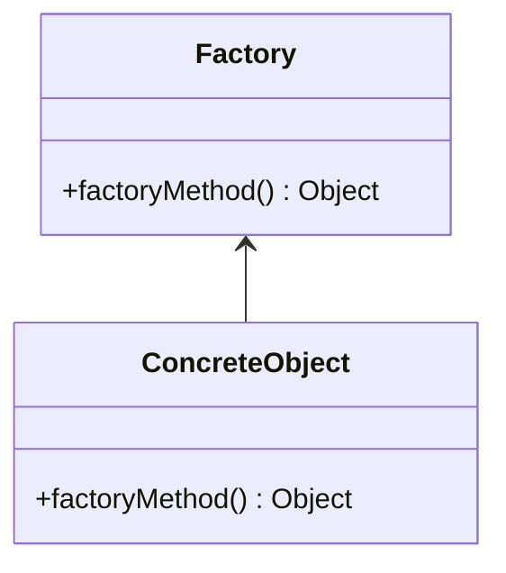

# Factory Method Pattern

-   Opposite of the Singleton pattern

## Concepts

-   Doesn't expose instantiation logic
-   Defer to subclasses
-   Common interface
-   Commonly specified by architecture, implemented by user

## Java API Example

-   `Calendar`: could be confused with Singleton
-   `ResourceBundle`
-   `NumberFormat`

## Design



-   Factory is responsible for lifecycle
-   Common Interface
-   Parameterized create method

## Everyday Example - Calendar

```java
Calendar cal = Calendar.getInstance();
System.out.println(cal); // return GregorianCalendar
System.out.println(cal.get(Calendar.DAY_OF_MONTH));
```

> `getInstance()` is overloaded, witch indicate its not a Singleton
