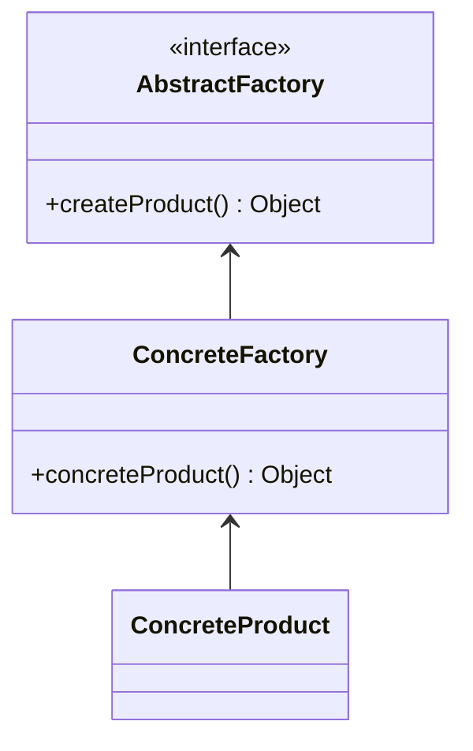

# Abstract Factory Pattern

## Concepts

-   Factory of Factories (Factory Method Pattern)
-   Factory of related objects
-   Common interface
-   Defer instanciation logic to subclasses

## Java API Example

-   `DocumentBuilder`
-   Mostly implemented in Frameworks

## Design



-   Groups Factories together
-   Factory is responsible for lifecycle
-   Common Interface (`AbstractFactory`)
-   Concrete Classes returned
-   Parameterized create method
-   Typicaly build using **Composition**

## Everyday Example - `DocumentBuilderFactory`

```java
DocumentBuilderFactory abstractFactory = DocumentBuilderFactory.newInstance();
DocumentBuilder factory = abstractFactory.newDocumentBuilder();
Document doc = factory.parse(bais)
```

> -   `DocumentBuilderFactory` is an **abstract factory**
> -   `DocumentBuilder` is a factory
> -   `Document` is the concrete class returned
