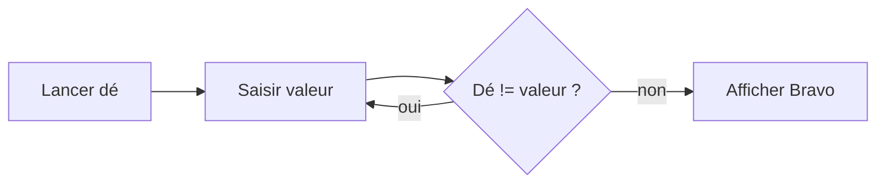

# L'algorithmique

## Définition

Un algorithme c’est une **suite d’instructions** qui aboutissent au **résultat** attendu

## Pourquoi utiliser un algorithme ?

Un algorithme décrit une **méthode de résolution** de problèmes courants
Apprendre l’algorithmique c’est apprendre à programmer dans les règles de l’art

## Le formalisme

Un algorithme doit être clair et lisible, on utilise deux moyens:

- soit d’écrire l’algorithme sous forme de texte simple et évident
- soit de faire un schéma explicatif avec des symboles

### L’algorithme sous forme graphique

Les algorithmes peuvent être construits à l’aide de symboles d’**organigrammes**:

- les traitements sont dans des **rectangles**
- les prises de décision dans des **losanges**
- les **flèches** représentent l’ordre du déroulement du programme



### L’algorithme sous forme de texte

```pascal
VAR
 dé: entier,
 valeur: entier

BEGIN
 de <- aléatoire(6)
 valeur <- 9
 while valeur <> dé do
    Saisir valeur
 end
 Afficher "Bravo"
END
```

## La complexité

- Plus un algorithme est **complexe**, plus il est **coûteux** et moins il est efficace.
- L’utilité de connaître la complexité des algorithmes et **d’optimiser** ceux­-ci
- Ordre des compléxité, du **plus au moins performant**:
  - `O(1)`: complexité constante
  - `O(log(n))`: complexité logarithmique
  - `O(n)`: complexité linéaire
  - `O(n2)`: complexité quadratique
  - `O(n3)`: complexité cubique
  - `O(2n)`: complexité exponentielle
  - `O(n!)`: complexité factorielle

---

_fin de chapitre_
