# Linked List

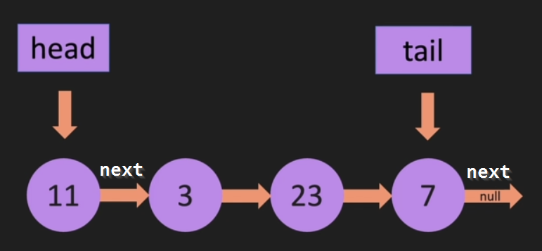

## Constructor

```java
class LinkedList {
    constructor(value) {
        const newNode = new Node(value);
        this.head = newNode;
        this.tail = newNode;
        this.length = 1;
    }
}
```

## `push(value)`

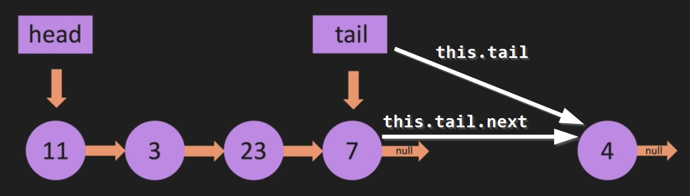

## `pop()`

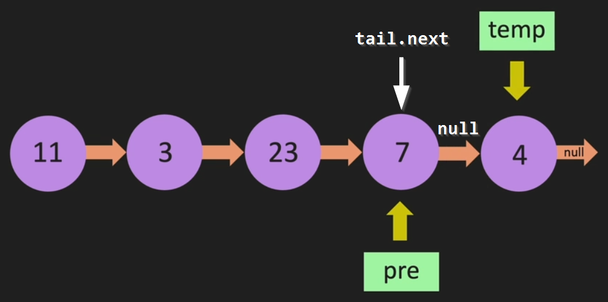

## `unshift()`

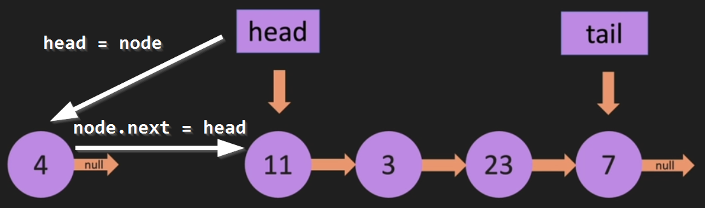

## `shift()`

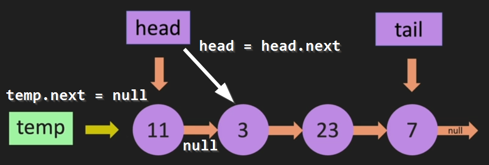

## `get(index)`

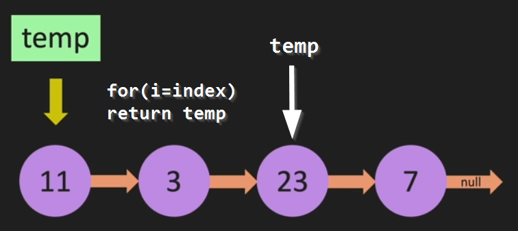

## `set(index, value)`

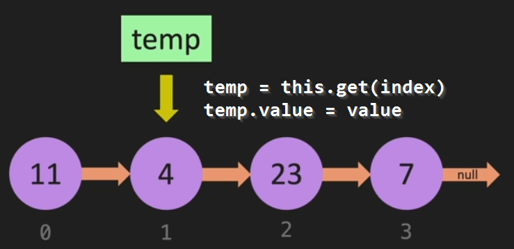

## `insert(index, value)`

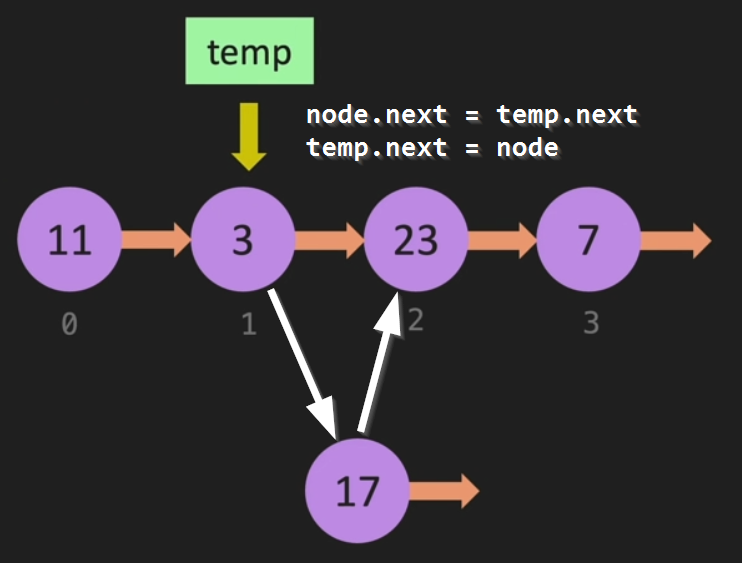

## `remove(index)`

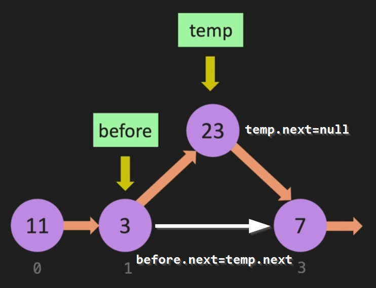

## `reverse()`

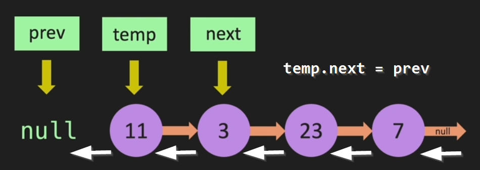

# Doubly Linked List

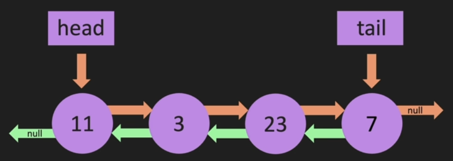

## Doubly Linked List VS Linked List

-   The **constructors** are stricly the same
-   The **node** has a `previous` field in a Doubly Linked List

```java
class Node {
    constructor(value) {
        this.value = value;
        this.next = null;
        this.previous = null;
    }
}
```

# Stack

-   Stack is a "_last in, first out_" using `push` and `pop`
-   We should use an array for a stack because `pop` is **O(1)**
    > If we use a Linked List we should `push`/`pop` on the **head** because it's **O(1)** > 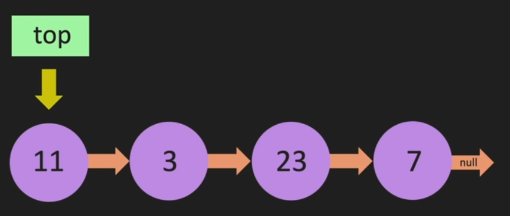

```java
class Stack {
    constructor(value) {
        const newNode = new Node(value);
        this.top = newNode;
        this.length = 1;
    }
}
```

> The **Node** class is the same as with Linked List

# Queue

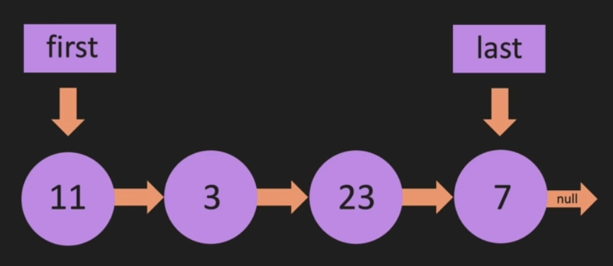

-   Queue is a "_first in, first out_" using `enqueue` and `dequeue`:
    -   We `enqueue` by _pushing_ with the `last`
    -   We `dequeue` by _unshift_ with the `first`

```java
class Queue {
    constructor(value) {
        const newNode = new Node(value);
        this.first = newNode;
        this.last = newNode;
        this.length = 1;
    }
}
```

> The **Node** class is the same as with Linked List
