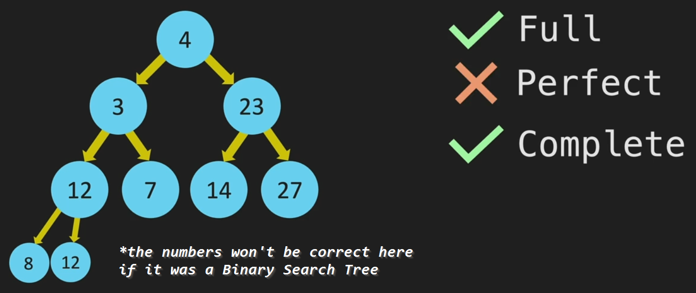

# Binary Tree

## Terminology

-   **Full Tree**: All nodes terminate with either 0 or two nodes
-   **Perfect Tree**: Is full and also symetric
-   **Complete Tree**: Is an _incomplete_ perfect tree



> **Leaf node**: a node without a child (it terminate)

> A **Linked List** is a Binary Tree that never fork

## Big O

-   All operations are **O(logN)**: `lookup()`, `insert()`, `remove()`
    > **Arrays** and **Linked List** perform better only to `insert()` a node (O(1))

## Constructor

```java
class BST {
    constructor() {
        this.root = null;
    }
}
class Node {
    constructor(value) {
        this.value = value;
        this.left = null;
        this.right = null;
    }
}

```

## Pseudo Code

### `insert(value)`

```
create newNode
while true
    if temp < left, else > right
        if null insert newNode, else move temp to next
```

> note: we can have duplicates by adding a count field to the node class

### `contain(value)`

```
while temp
    if value < temp.value
        temp = temp.left
    if value > temp.value
        temp = temp.true
    else return true (found)
return false (not found)
```
