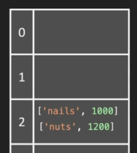

# Hash Table

## Colision

Common collisions resolution:

-   separate chain: when a collision occurs, the new element is simply appended to the array or linked list.
    > we can chain with either an array or a linked list
-   Open Addressing: when a collision occurs, we store at the next available slot in the array.
    > Linear Probing is the common strategie

We will use **separate chain** in this course

> each bucket contains an array of key-value:
> `[[key, value],[key, value]]`
