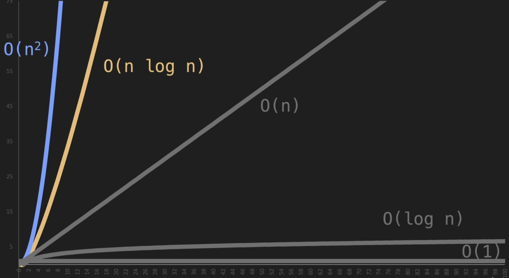
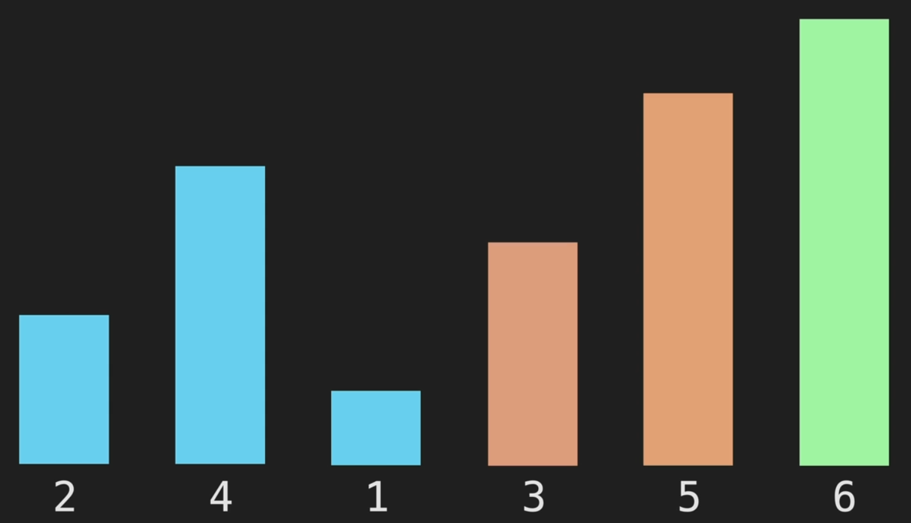
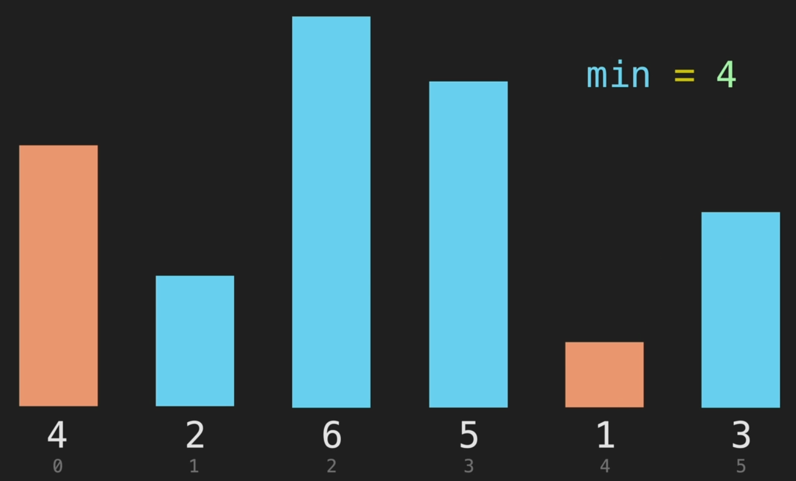
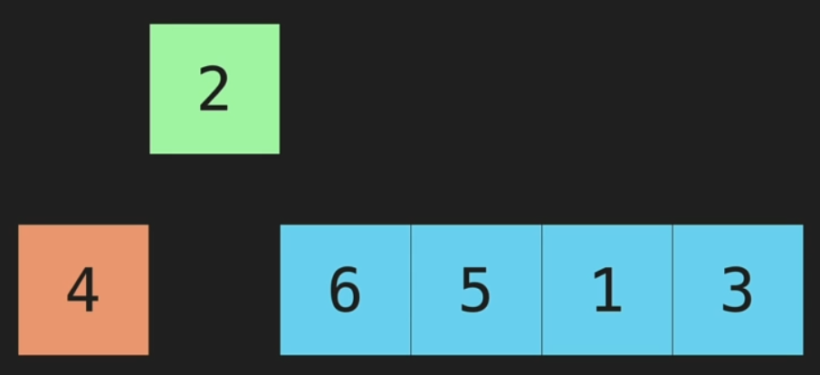
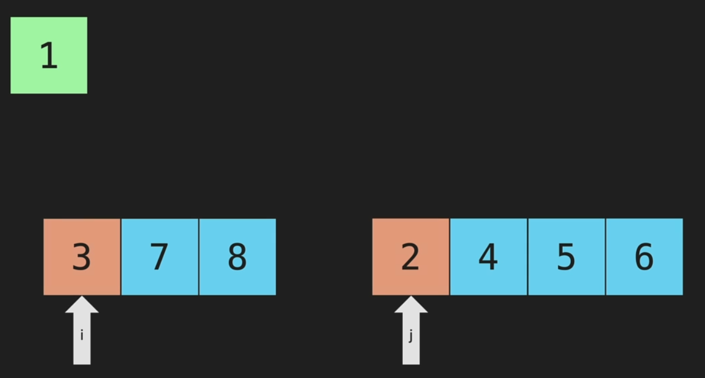
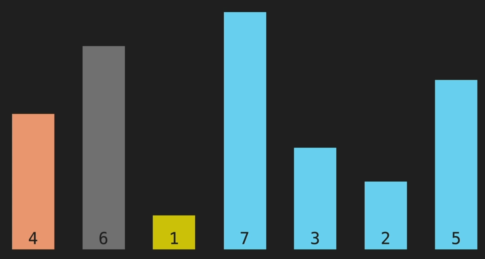

# Time Complexity

The **merge sort** is a `O(N logN)` operation, and still performs better than the other sorting algorithm witch are `O(n2)`

# Bubble Sort

Compare with the next element, if its larger, it swap there position

# Selection Sort

We compare the first element with the rest, and store the position of the lowest element, then swap the lowest with the first element

# Insertion Sort

We start with the second element and compare with the first, if its larger, we swap them

# Merge Sort

We compare two **sorted** array

# Quick Sort

The first element is used as a **_pivot point_**
we swap the next lowest element with the next larger element

> the Quick sort (`O(n2)`) is still less performant than a merge sort (`O(N logN)`)

> We need to swap `1` and `6`here
