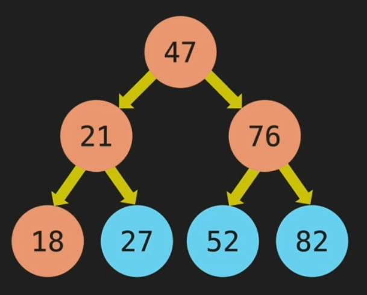
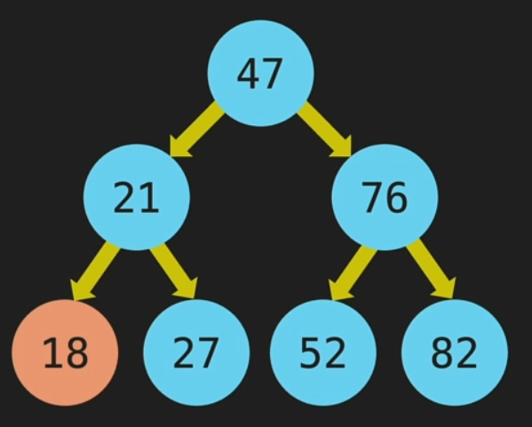

# Tree Traversal

-   **Breadth First Search**: We traverse row by row

    

    > BFS guarantees that it visits all vertices at the current level before moving on to the vertices at the next level.

-   **Depth First Search**: We start as deep possible

    

    > Then it traverse 21, 27, 47, ...
