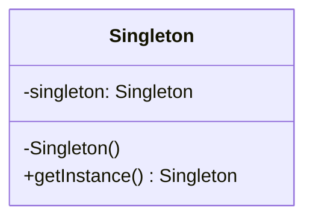

# Singleton Pattern

## Concept

-   Guarantee one instance
-   Guarantee control of a resource
-   Lazily loaded

## Identifying

```typescript
let instance = Singleton.getInstance();
let otherInstance = Singleton.getInstance();
```

## Java Library Example

-   `Runtime`
-   `Logger`
    > It could also be a factory depending of the implementation
-   Spring Beans
-   Graphic Managers

## Design

-   Class is responsible for lifecycle
-   Static in nature
    > It's not implemented using `static` class because static don't guaranty thread safety



> `getInstance()` has no parameters, if there were parameters, it would have been a **_factory pattern_**

## Everyday Example

```java
Runtime singletonRuntime = Runtime.getRuntime();
Runtime anotherInstance = Runtime.getRuntime();
```

## Pitfalls

-   Often overused
-   Difficult to unit test
-   If not careful, not thread-save
-   Sometimes confused with Factory

## Singleton vs Factory Pattern

| Singleton                 | Factory                   |
| ------------------------- | ------------------------- |
| Returns same instance     | Returns various instances |
| One constructor - no args | Multiple constructors     |
| No Interface              | Interface driven          |
| -                         | Adaptable to environment  |
