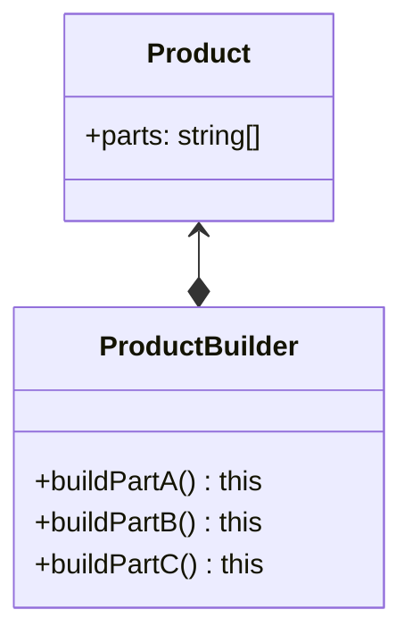

# Builder Pattern

## Concept

The **Builder Pattern** is used to construct a **_complex object step by step_**.

-   Handles complex constructors:
    -   large number of parameters
    -   or large number of setters
-   We make the object immutable when we are done constructing it

## Identifying

```typescript
const user: User = new UserBuilder()
    .setUsername('john_doe')
    .setEmail('john@example.com')
    .build(); // return a User object
```

> `user` has no setters on its own, so it can not be modified

## Java Library Example

-   `StringBuilder`
-   `DocumentBuilder`
-   `Locale.Builder`

## Design



## Everyday Example

```java
StringBuilder builder = new StringBuilder();
builder.append("This is an example ");
builder.append("of the builder pattern");
```

## Pitfalls

-   Typically designed to be **immutable**

## Builder vs Prototype Pattern

The **Builder** tries to work with complex constructors while the **Prototype** tries to avoid calling the constructor again.
| Builder | Prototype |
| ------------------------------------------------------------------------------------------------------------------------ | -------------------------------------------------------------------------------------------- |
| Focused on constructing a complex object step by step with a dedicated builder class | Focused on creating new objects by cloning an existing prototype |
| Often used in scenarios where the number of parameters can vary, and you want to enhance readability and maintainability | Useful for scenarios where object creation is more efficient by copying an existing instance |
