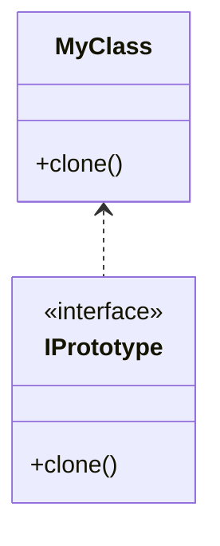

# Prototype Pattern

-   Guarantee unique instance
-   Solve performance issues

## Concept

-   Avoid costly creation
-   Avoids subclassing
-   Typically doesn't use `new`
-   Often utilizes an Interface
-   Usually implemented with a Registry

## Identifying

```typescript
// Client code
const registry = new PrototypeRegistry();
// Create and register prototype instances
const prototypeA = new ConcretePrototype('Prototype A');
registry.register('A', prototypeA);
// Clone prototype instances
const instanceA = registry.createInstance('A');
```

## Java Library Example

-   `java.lang.Object.clone()`

## Design



-   We use `clone()` to avoid `new`
-   typically we don't utilize parameters for construction

## Pitfalls

-   Often not used, not clear when to use
-   Typically used with other patterns
    > if a pattern contains other patterns, it is a framework
-   We usually need a deep copy instead of a shallow copy
    -   Deep copy adds complexity, which questions the solvability of the pattern in the first place

## Prototype vs Factory Pattern

| Prototype                                                            | Factory                                     |
| -------------------------------------------------------------------- | ------------------------------------------- |
| Lighter weight construction with **_Copy Constructor_** or `Clone()` | Flexible Objects with multiple constructors |
| Copy of itself with Shallow or Deep Copy                             | -                                           |
