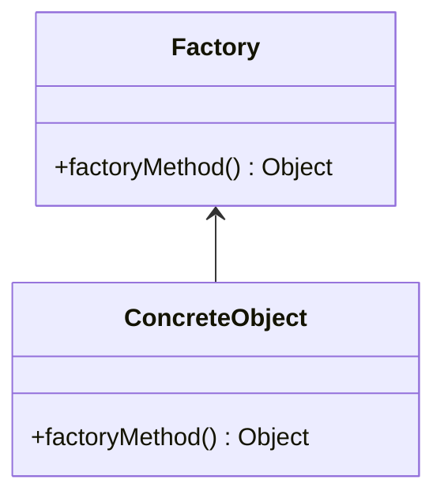

# Factory Method Pattern

-   Parameter Driven (this is the key implementation)
-   Solves complex creation
-   Opposite of the Singleton pattern in many caracteristics

## Concepts

-   Doesn't expose instantiation logic
-   Defer instanciation logic to subclasses
-   Common interface
-   Commonly specified by architecture, implemented by user

## Identifiying

```typescript
const blogSite: Website = WebsiteFactory.getWebsite(WebsiteType.BLOG);
const shopSite: Website = WebsiteFactory.getWebsite(WebsiteType.SHOP);
```

> The `WebsiteFactory` returns a `Website` object based on the argument

## Java API Example

-   `Calendar`: could be confused with Singleton
-   `ResourceBundle`
-   `NumberFormat`

## Design



-   Factory is responsible for lifecycle
-   Common Interface
-   Parameterized create method

## Everyday Example - Calendar

```java
Calendar cal = Calendar.getInstance();
System.out.println(cal); // return GregorianCalendar
System.out.println(cal.get(Calendar.DAY_OF_MONTH));
```

> `getInstance()` is overloaded, witch indicate its not a Singleton

## Pitfalls

-   Complexity
-   We need to design ahead

## Factory vs Singleton Pattern

| Factory                             | Singleton                          |
| ----------------------------------- | ---------------------------------- |
| Returns various instances           | Return the same instance           |
| Multiple constructors with args     | One constructor method with noargs |
| Interface driven (contract driven)  | No interfaces                      |
| Always subclasses involve           | no subclasses                      |
| Easily adaptable to the environment | -                                  |
