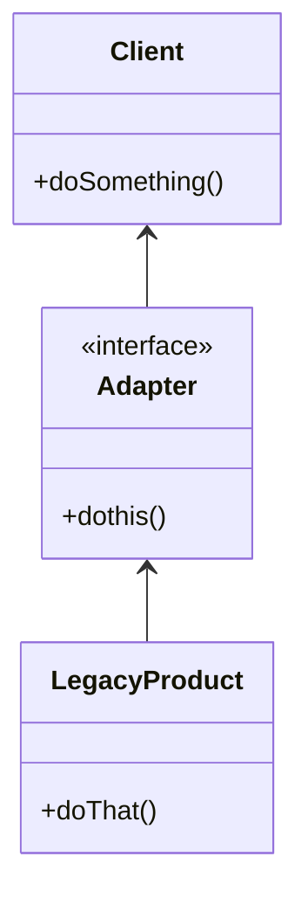

# Adapter Pattern

Used to connect new code with legacy code

-   Simple solution for a descriptive problem
-   Easy to implement
-   Used to integrate with Legacy code
-   Usally implements multiple adapters
    > Common mistake is to try to use only one adapter for multiple use cases

## Concepts

-   Plug adaptor
-   Convert interface into another interface
-   Translates legacy code to the client code

## Identifing

```typescript
let employeeFrommLdap: Employee = new EmployeeAdapterLdap(employeeFromLdap);
```

> `EmployeeAdapterLdap` returns a legacy `Employee`

## Java API Example

-   `Collection`: Arrays (legacy) -> to Lists (new code)
-   `Stream`: All streams have adapter to connect to readers

## Design



-   Client centric
-   Integrate new with old
-   Interface, but not required
-   Adaptee can be the implementation

## Everyday Example - `Arrays.asList`

```java
Integer[] arrayOfInts = new Integer[] {42, 43, 44};
List<Integer> listOfInts = Arrays.asList(arrayOfInts);
```

> `asList(arrayOfInts)` is **adapting fonctionnality**. If we wanted to **_add more fonctionnality_**, we would use the **_decorator pattern_**

## Pitfalls

-   dont' add functionality, use Decorator instead

## Adapter vs Bridge Pattern

Both are meant to adapt multiple systems

| Adapter                                       | Bridge                                            |
| --------------------------------------------- | ------------------------------------------------- |
| Works after code is designed                  | Designed upfront                                  |
| Dealing with legacy code                      | Abstraction and implementation vary independently |
| Retrofitted (unrelated classes work together) | -                                                 |
| Provides different interface to legacy code   | -                                                 |
