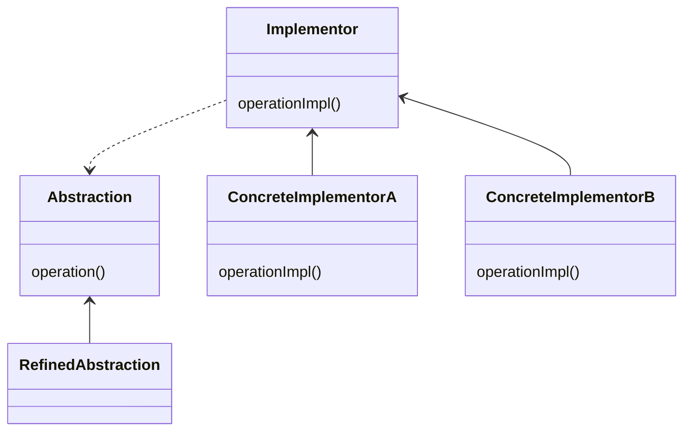

# Bridge Pattern

-   Designed for uncertainty (we don't necessarily know the implementation details)
-   Provides flexibility
-   We idealize composition, but also inheritance and interfaces

> Bridge works with new code while Adapter works with old code

## Concepts

-   Decouple Abstraction and implementation
-   Encapsulation, Composition, Inheritance
-   Changes in Abstraction won't affect client
    > The client is not aware of the Abstraction

## Java API Example

-   `JDBC` Driver

## Design



-   Interfaces and Abstract classes
-   Composition over Inheritance
-   Expect change from both sides
-   Implementation: Abstraction, Implementor, Refined Abstraction, Concrete Implementor

## Everyday Example - `JDBC`

```java
DriverManager.registerDriver(new org.apache.derby.jdbc.EmbeddedDriver());
String dbUrl = "jdbc:derby:memory:codejava/webdb;create=true";
Connection conn = DriverManager.getConnection(dbUrl);
Statement sta = conn.createStatement();
// This client is an abstraction and
// ... can work with any database that has a driver
sta.executeUpdate("CREATE TABLE Address()");
```

> The database **_can change_** and the client **_can also change_**

## Pitfalls

-   Increases complexity
-   Conceptually difficult to plan

## Bridge vs Adapter

| Bridge           | Adapter                      |
| ---------------- | ---------------------------- |
| Designed upfront | works after code is designed |
