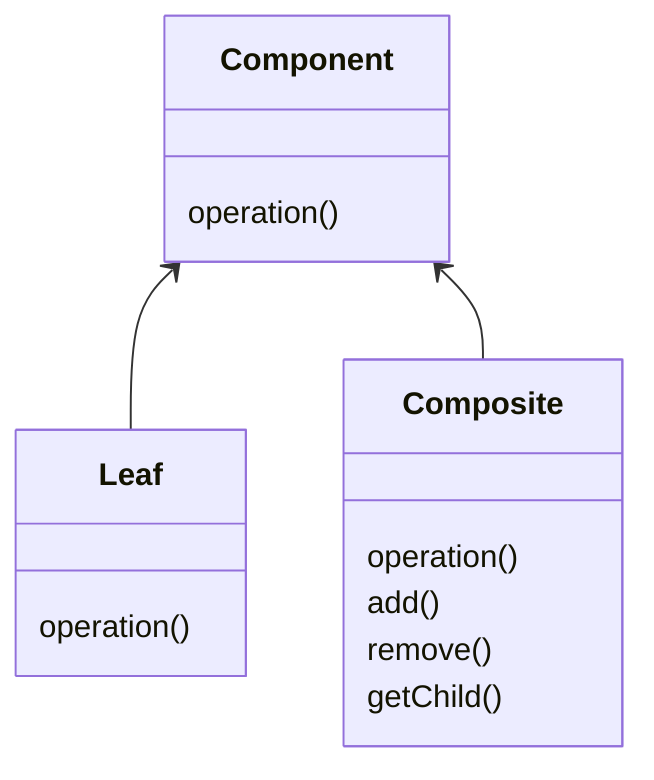

# Composite

Deals with hierarchical type pattern that deals with tree structure of information

-   Generalizes a hierarchical structure
-   Can simplify things too much (difficult to restrict)
-   Makes it easier for clients (manupulate objects the same way)
-   Composite != Composition
    -   Composite deals with hierarchical structure
    -   Composition is an object containing an other

## Concept

-   Components represent part or whole structure
-   Compose objects into tree structures
-   individual object treated as a Composite
-   Same operations applied on individual and composites

## Java API Example

-   java.awt.Component
-   JSF widgets
-   RESTful service GETs

## Design



-   Tree structured
-   The root is the Component
-   Component are either a Leaf or a Composite of objects
-   Leaf and Composite have the same operations
-   Composite has also operations to deal with its childrens
-   Structure: Component, Leaf, Composite

## Everyday Example - Map

```java
Map<String, String> personAttributes = new HashMap<>();
personAttributes.put("site_role", "person");

Map<String, String> groupAttributes = new HashMap<>();
groupAttributes.put("group_role", "claims");

Map<String, String> secAttributes = new HashMap<>();

secAttributes.putAll(personAttributes);
secAttributes.putAll(groupAttributes);
```

## Pitfalls

-   Can overly simplify system
    -   Difficult to restrict
    -   Everything is treated the same

## Composite vs Decorator

| Composite                              | Decorator                             |
| -------------------------------------- | ------------------------------------- |
| Tree structure                         | Contains another entity (composition) |
| Leaf and Composite have same interface | Adds behavior                         |
| Unity between objects                  | Doesn't change underlying object      |

> Composition is just an object containing another one
