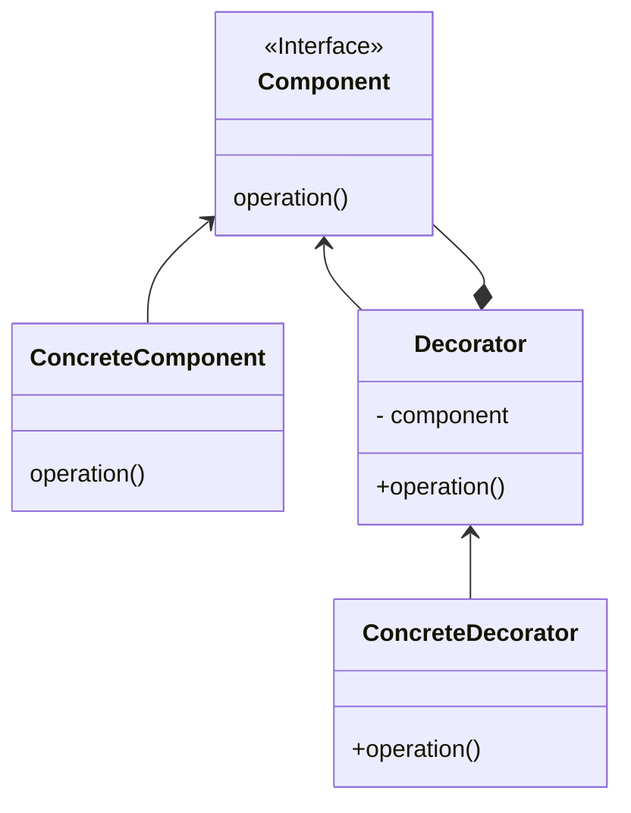

# Decorator Pattern

The Decorator Pattern is a hierarchical design approach that adds functionality without changing underlying object

- Original object can stay the same
- Can be more complex for clients (confusing)
- Still a great pattern if we don't want to modify the base object

## Identifing

```typescript
let sandwich = new DressingDecorator(new MeatDecorator(new SimpleSandwich()));
console.log(sandwich.make());
```

> Decorators can take either other Decorators or the concrete base object

> Even it fills like a Creational patterns, **it is a structural patterns** because it primarily focuses on how classes and objects are composed, rather than focusing on the creation or instantiation of objects.

## Concept

- Wrap another object to add functionality
- Add behavior without affecting others
- More than just inheritance
- Follows single responsability principle
- Compose behavior dynamically

  - it uses the subclasses that decorate our object

  > It's not a Creational Pattern because its adding behaviour thru creation

## Java API Example

- java.io.InputStream
- java.util.Collections#checkedList
  > not clear why Java decided to implement the `checkedList` method with a Decorator Pattern
- UI components (in AWT & Swing)
  > almost all UI components implemented with Decorator Pattern

## Design

- Inheritance based
- Utilizes composition and inheritance (is-a, has-a)
  > There is a commun component but functionality are added in the subcomponents
- Better alternative to subclassing because it follows single responsability principle
- Constructor requires instance from hierarchy to build upon that and use composition to overides individual fields



- The `ConcreteComponent` is what we **decorate**
- They both inherite from `Component` to be treated the same
- From here, we can implement multiple ConcreteDecorator to add functionality

## Everyday Example - InputStream

```Java
File file = new File("./output.txt");
file.createNewFile();

OutputStream oStream oStream = new FileOutpuStream(file);

DataOutputStream doStream = new DataOutputStream(oStream);
doStream.writeChars("text");
```

## Pitfalls

- New class for each feature added
- Multiple little objects
- Often confused with simple inheritance
- Often confused with simple inheritance
  > Decorator allow to add features without altering the concrete object
