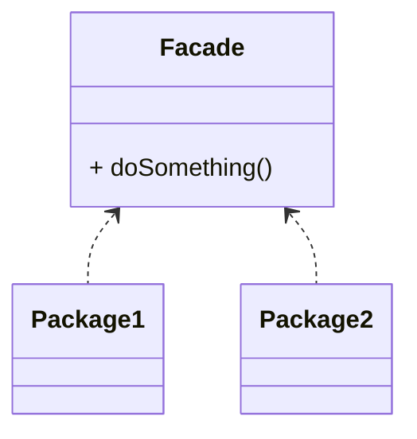

# Facade Pattern

The Facade Pattern simplifies interactions with a system by providing a unified interface

- Simplifies Client Interface
- Easy Pattern to implement
- Refactoring Pattern

## Concepts

- Make an API easier to use
- Reduce dependencies on outside code
- Simplify the interface or client usage
- Can be taught of a refactoring pattern

## Java API Example

- java.net.URL
- javax.faces.context.FacesContext

## Design

- It's a class that utilizes composition
- shouldn´t have a need for inheritance
- Typically encompasses full lifecycle

> There is no typical diagram because it depend on the API we are wrapping

## Pitfalls

- Typically used to clean up code
- It can be taught of the singleton of structural pattern

### Facade vs Adapter

| Facade                | Adapter                       |
| --------------------- | ----------------------------- |
| Simplifies Interface  | Also a refactoring pattern    |
| Works with composites | Adds behavior                 |
| Cleaner API           | Provide a different interface |
